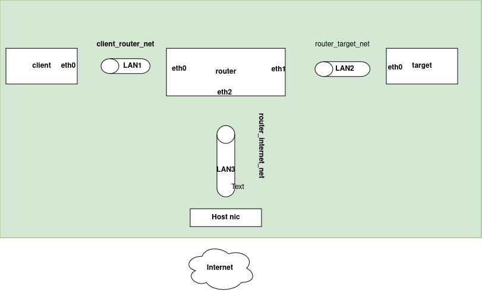

---

# TP 6 : Mise en place d'un VPN sécurisé avec WireGuard (VMS sous Alpine Linux)

### Objectif :
Sécuriser les communications entre un **Client** (Machine A) et une **Target** (Machine B), via un tunnel VPN sécurisé avec **WireGuard**.

### Outils :
- **WireGuard**
- **OpenTofu**
- **Ansible**
- 3 machines virtuelles sous **KVM** avec **Alpine Linux** :
  - **Client (Machine A)**
  - **Router (Machine C)**
  - **Target (Machine B)**

### Infrastructure à mettre en place



### Plan de travail :

1. Une base de code est fournie, il vous est demandé de concevoir votre plan d'addressage.
2. Assurez-vous de modifier le code de base pour faire fonctionner l'architecture du réseau sous WireGuard.
3. Passez en revue tous les fichiers pour vérifier que tout est configuré correctement.

---

### Description des fichiers :

1. **Clés SSH à utiliser** :
   - `ares`  
   - `ares.pub`  

2. **Dossier de configuration de WireGuard pour le client et la target** :
   - **Client** : contient le fichier de configuration `wg0.conf` pour le client.
   - **Target** : contient le fichier de configuration `wg0.conf` pour la target.

   > Les clés WireGuard ont été générées.

   Pour générer une paire de clés WireGuard (assurez-vous que `wireguard-tools` soit installé) :

   ```bash
   umask 077
   wg genkey | tee privatekey | wg pubkey | tee publickey
   ```

   Les fichiers de configuration de WireGuard ont été créés à l'avance. Modifier à votre convenance

3. **Fichier de configuration Ansible** :
   - `wg.yml`

4. **Code de l'infrastructure réseau à déployer** :
   - `main.tf`

5. **Fichiers d'orchestration** :
   - `run_ansible.sh` : Permet de configurer les machines.
   - `run_tofu.sh` : Permet de déployer l'infrastructure.

6. **Fichier d'inventaire des machines virtuelles** :
   - `hosts`

---

### Faire le test :

#### Sur la machine du routeur :

Exécutez la commande suivante pour observer le trafic WireGuard :

```bash
tcpdump -i any udp port 51820
```

> Vous devriez observer le trafic WireGuard sur le port 51820.

---

#### Sur la machine du client :

1. **Test du ping** :

   Pinguez l'IP privée de la Target pour vérifier la connectivité :

   ```bash
   ping -c 10 IP_PRIVE_TARGET_A_CHOISIR
   ```

2. **Téléchargement d'une page** :

   Téléchargez une page via HTTP pour tester la connectivité :

   ```bash
   curl http://IP_PRIVE_TARGET_A_CHOISIR
   ```

3. **Vérification de l'état du trafic WireGuard** :

   Pour vérifier l'état de la connexion WireGuard, utilisez la commande :

   ```bash
   wg
   ```

   > Confirmez que des données ont transité via le tunnel WireGuard.

4. **Couper WireGuard sur la target** :

   Désactivez l'interface WireGuard sur la machine cible :

   ```bash
   wg-quick down wg0
   ```

   Refaites le ping et constatez qu'il ne fonctionne plus.

5. **Relancer l'interface WireGuard sur la target** :

   Relancez l'interface WireGuard sur la machine cible :

   ```bash
   wg-quick up wg0
   ```

   Refaites le ping et constatez que la connexion fonctionne à nouveau.

---

Question ?
   
      - Que faut-il sur le routeur pour faire fonctionner l'architecture ? détailler votre réponse
      - Que faut-il sur la target pour permettre au client d'accéder à internet ? détailler votre réponse
      - Fournir les fichiers wg0.conf
      - Fournir l'architecture complété avec le plan d'addressage
       


